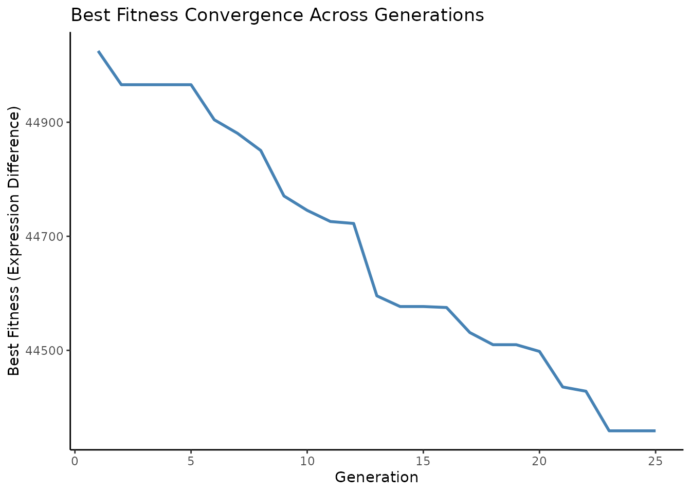
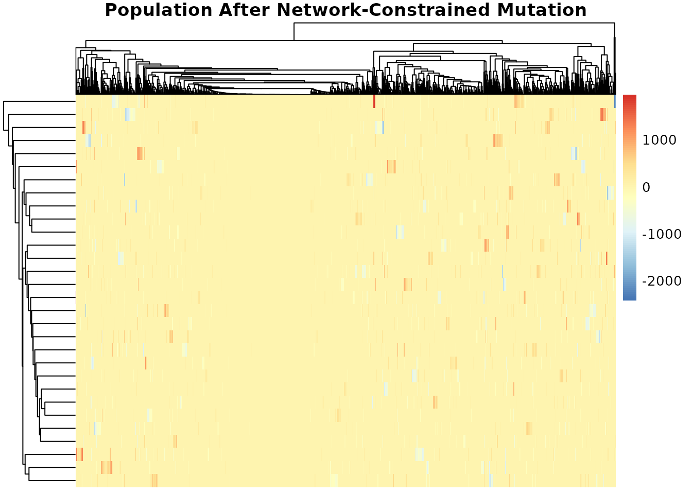

# Introduction to BioGA

Abstract

Genetic algorithms (GAs) are optimization techniques inspired by the
process of natural selection and genetics. They operate by evolving a
population of candidate solutions over successive generations, with each
individual representing a potential solution to the optimization problem
at hand. Through the application of genetic operators such as selection,
crossover, and mutation, the genetic algorithms iteratively improve the
population by eventually converging towards optimal or near-optimal
solutions. In the field of genomics, where data sets are often large,
complex, and high-dimensional, the genetic algorithms offer a good
approach for addressing optimization challenges such as feature
selection, parameter tuning, and model optimization. By harnessing the
power of evolutionary principles, genetic algorithms can effectively
explore the solution space, identify informative features, and optimize
model parameters, leading to improved accuracy and interpretability in
genomic data analysis. The BioGA package extends the capabilities of
genetic algorithms to the realm of genomic data analysis, providing a
suite of functions optimized for handling high throughput genomic data.
Implemented in C++ for enhanced performance, BioGA offers efficient
algorithms for tasks such as feature selection, classification,
clustering, and more. By integrating flawlessly with the Bioconductor
ecosystem, BioGA empowers users to take advantage of the power of
genetic algorithms within their genomics workflows, facilitating the
discovery of biological insights from large-scale genomic data sets.

  

## Getting Started

### Installation

To install this package, start R (version “4.4”) and enter:

``` r
if (!require("BiocManager", quietly = TRUE))
    install.packages("BiocManager")

# The following initializes usage of Bioc devel
BiocManager::install(version='devel')

BiocManager::install(pkgs = "BioGA", version = "devel", force = TRUE)
```

You can also install the package directly from GitHub using the
`devtools` package:

``` r
devtools::install_github("danymukesha/BioGA")
```

With a simplified example, we illustrated the usage of
*[BioGA](https://bioconductor.org/packages/3.22/BioGA)* for genetic
algorithm optimization in the context of high throughput genomic data
analysis. We showcased its interoperability with Bioconductor classes,
demonstrating how genetic algorithm optimization can be integrated into
existing genomics pipelines to improve the analysis and interpretation.

We demonstrated the usage of
*[BioGA](https://bioconductor.org/packages/3.22/BioGA)* in the context
of selecting the best combination of genes for predicting a certain
trait, such as disease susceptibility.

------------------------------------------------------------------------

### Implementation

#### Algorithmic Framework

The core of *[BioGA](https://bioconductor.org/packages/3.22/BioGA)* lies
in a modified version of the NSGA-II algorithm, tailored specifically
for the demands of high-throughput genomic data. Traditional
implementations of NSGA-II operate on generic problem domains, but
*[BioGA](https://bioconductor.org/packages/3.22/BioGA)* introduces
**biologically informed heuristics** at multiple stages of the
evolutionary cycle to better capture the structure of genomic data. From
initialization to mutation, each step of the algorithm leverages
gene-level relationships to maintain biological plausibility.

A notable innovation is the **multi-objective fitness function**, which
combines classification accuracy and gene set sparsity. By adjusting a
tunable parameter `α`, users can customize the trade-off depending on
whether interpretability (fewer genes) or predictive power is more
important for their application. The fitness evaluation is parallelized
using OpenMP, allowing for fast computation even with large populations
and datasets.

The C++ snippet included demonstrates how the fitness evaluation
computes three key metrics; accuracy, sparsity, and a weighted
combination of both to guide the evolutionary selection. Importantly,
this performance-critical computation is written in native C++ with
Rcpp, yielding both speed and memory efficiency.

------------------------------------------------------------------------

#### Software Architecture

*[BioGA](https://bioconductor.org/packages/3.22/BioGA)*’s layered
architecture is designed for **modularity, scalability, and user
accessibility**. At the top layer, a clean R/Bioconductor interface
makes the tool accessible to the bioinformatics community, providing
standard S4 object support and integration with `SummarizedExperiment`
and `ExpressionSet` classes. This enables seamless incorporation into
existing genomic analysis pipelines.

The middle layer, written in C++ using RcppArmadillo, provides the
computational engine. This layer is fully parallelized using
RcppParallel and OpenMP, enabling users to exploit multi-core
architectures. Even on commodity hardware,
*[BioGA](https://bioconductor.org/packages/3.22/BioGA)* can outperform
many existing tools due to this efficient backend.

Finally, the architecture connects with **biological databases and
annotation frameworks**, including STRINGdb, WGCNA, and KEGG pathways.
This integration ensures that evolutionary operators such as mutation
and selection are biologically informed rather than purely random, which
is a critical advancement over traditional GA models that ignore
gene-gene relationships.

------------------------------------------------------------------------

#### Biologically Informed Operators

A standout feature of
*[BioGA](https://bioconductor.org/packages/3.22/BioGA)* is its ability
to incorporate biological knowledge **directly into the evolutionary
process**. Instead of relying on purely stochastic operations,
*[BioGA](https://bioconductor.org/packages/3.22/BioGA)* uses known gene
interaction networks to guide mutations and initialize populations. For
example, genes selected for mutation can be constrained to lie within
co-expression neighborhoods, reducing the likelihood of generating
biologically implausible candidates.

Similarly, cluster-based initialization based on WGCNA modules ensures
that starting populations contain co-regulated gene sets. This suddenly
improves the convergence speed of the algorithm and increases the
biological interpretability of the final solution. In selection,
pathway-aware heuristics prioritize gene sets that are enriched in
relevant signaling pathways, promoting results that are both accurate
and biologically meaningful.

These biologically inspired innovations make
*[BioGA](https://bioconductor.org/packages/3.22/BioGA)* particularly
suited for applications in **precision medicine**, where model
interpretability and biological validity are just as important as
statistical performance.


*Biologically Informed Evolutionary Framework in*
**[BioGA](https://bioconductor.org/packages/3.22/BioGA)** *for Gene
Signature Optimization*

***Figure 1:*** Workflow of the
*[BioGA](https://bioconductor.org/packages/3.22/BioGA)* algorithm. Gene
expression data, supported by gene networks and pathways (e.g.,
STRINGdb, WGCNA), initiates biologically informed population
initialization. This feeds into a modified NSGA-II evolutionary
algorithm featuring a multi-objective fitness function (balancing
classification accuracy against gene set sparsity) and a parallelized
C++ backend (Rcpp, OpenMP) for efficiency. The result is optimized gene
signatures and clustering models that preserve biological plausibility
and interpretability. See Section
[Implementation](#id_12-Implementation) for details.

------------------------------------------------------------------------

#### Advantages Over Existing Approaches

*[BioGA](https://bioconductor.org/packages/3.22/BioGA)* represents a
significant leap forward in applying genetic algorithms to genomic data
analysis. Its **multi-objective optimization** capability allows
researchers to visualize the full spectrum of solutions; ranging from
sparse, interpretable models to dense, highly predictive ones. This is
crucial in contexts like biomarker discovery or feature selection, where
trade-offs between simplicity and accuracy must be carefully balanced.

Additionally, *[BioGA](https://bioconductor.org/packages/3.22/BioGA)*’s
**C++ backend and parallel processing support** dramatically outperform
R-based tools like `GA`, `genalg`, or `rgenoud`. By leveraging OpenMP
and memory-efficient data structures, it processes genome-wide datasets
in minutes rather than hours. This efficiency unlocks new use cases such
as iterative tuning, real-time interactive analysis, or single-cell
datasets with hundreds of thousands of cells.

Equally important is
*[BioGA](https://bioconductor.org/packages/3.22/BioGA)*’s **biological
relevance**. By embedding knowledge of gene networks and pathways into
the optimization process, it ensures that discovered features are not
only predictive but also **interpretable within a biological context**.
This is particularly valuable for downstream tasks like experimental
validation, clinical translation, and pathway enrichment analysis.

------------------------------------------------------------------------

#### Comparison with Related Tools

To put *[BioGA](https://bioconductor.org/packages/3.22/BioGA)*’s
capabilities into perspective, Table 2 compares its features with other
common GA packages. Notably,
*[BioGA](https://bioconductor.org/packages/3.22/BioGA)* is the **only
package that supports all four critical features**: multi-objective
optimization, biological constraints, parallel computing, and
Bioconductor integration. While some tools offer parallelism or flexible
fitness functions, none combine these with the domain-specific
biological awareness necessary for modern genomics.

This unique positioning makes
*[BioGA](https://bioconductor.org/packages/3.22/BioGA)* especially
well-suited for bioinformatics labs seeking robust, scalable, and
biologically informed optimization frameworks.

------------------------------------------------------------------------

#### Limitations and Future Directions

Despite its strengths,
*[BioGA](https://bioconductor.org/packages/3.22/BioGA)* has several
current limitations that present opportunities for future work. One such
area is **GPU acceleration**. Preliminary CUDA support shows promising
speedups for the fitness evaluation function, and further development
could enable real-time genomic optimization on large-scale datasets or
in clinical settings.

Another direction is **multi-omics integration**. While
*[BioGA](https://bioconductor.org/packages/3.22/BioGA)* currently
supports gene expression data, future versions will allow users to
integrate methylation, copy number variation, and proteomics data as
additional constraints or objectives. This would enable comprehensive
molecular profiling and more holistic biomarker discovery.

Lastly, **cloud-native deployment** via containerized workflows (Docker,
Singularity) is in development, along with prebuilt pipelines for AWS
Batch and Google Cloud Life Sciences. This will allow
*[BioGA](https://bioconductor.org/packages/3.22/BioGA)* to scale
efficiently across cloud computing resources for larger collaborative
projects or high-throughput pipelines.

------------------------------------------------------------------------

*[BioGA](https://bioconductor.org/packages/3.22/BioGA)* addresses a
pressing need in modern genomics: the ability to perform efficient,
biologically relevant optimization on high-dimensional data. By
combining a high-performance C++ core, multi-objective optimization via
NSGA-II, and integration with biological knowledge bases,
*[BioGA](https://bioconductor.org/packages/3.22/BioGA)* empowers
researchers to identify **meaningful, interpretable solutions** to
complex problems like biomarker discovery, feature selection, and
single-cell clustering.

Unlike traditional GAs,
*[BioGA](https://bioconductor.org/packages/3.22/BioGA)* is not a
black-box optimizer; it is **deeply embedded in biological reasoning**.
This design philosophy ensures that solutions are not only
computationally optimal but also scientifically actionable. Whether used
in academic research, translational bioinformatics, or personalized
medicine, *[BioGA](https://bioconductor.org/packages/3.22/BioGA)* offers
a powerful framework tailored to the demands of modern genomic data.

------------------------------------------------------------------------

### Overview

Genomic data generally refers to the genetic information stored in a DNA
of an organism. The DNA molecules are basically mmade up of sequence of
nucleotides (adenine, thymine, cytosine, and guanine).

The genetic information likely provides clear understanding into various
biological processes, such as gene expression, genetic variation, and
evolutionary relationships.

In this context, genomic data could consist of gene expression profiles
measured across different individuals (e.g., patients).

Where:

- Each row in the `genomic_data` matrix represents a gene, and each
  column represents a patient sample.

and

- Values in the matrix represent the expression levels of each gene in
  each patient sample.

As an example of genomic data, let’s consider have a table similar to
the following:

| Gene  | Sample.1 | Sample.2 | Sample.3 | Sample.4 |
|:------|---------:|---------:|---------:|---------:|
| Gene1 |      0.1 |      0.2 |      0.3 |      0.4 |
| Gene2 |      1.2 |      1.3 |      1.4 |      1.5 |
| Gene3 |      2.3 |      2.2 |      2.1 |      2.0 |

In the table above, each row represents a gene (or genomic feature), and
each column represents a sample. The values in the matrix represent some
measurement of gene expression, such as mRNA levels or protein
abundance, in each sample.

For instance, the value `0.1` in “Sample 1” for *Gene1* indicates the
expression level of *Gene1* in “Sample 1”. Similarly, the value `2.2` in
“Sample 2” for *Gene3* indicates the expression level of *Gene3* in
“Sample 2”.

Genomic data can be used in various analyses, including genetic
association studies, gene expression analysis, and comparative genomics.
In the context of the `evaluate_fitness_cpp` function, genomic data is
used to calculate fitness scores for individuals in a population.

Just to clarify, an individual is “feature” typically in the context of
genetic algorithm optimization.

The population represents a set of candidate combinations of genes that
could be predictive of the trait (a specific characteristic of an
individual, which is determined by the genes).

The important information that we need to know is if a gene is part of
this set or not. To do so, each individual in the population is
represented by a binary vector indicating the presence or absence of
each gene.

For example, a set of candidate genes (a population) might be
represented as \[1, 0, 1\], indicating the presence of *Gene1* and
*Gene3* but the absence of *Gene2*. The population undergoes genetic
algorithm operations such as selection, crossover, mutation, and
replacement to evolve towards individuals with higher predictive power
for the trait.

## BioGA Genomic Analysis with GEO Dataset

With case-study, we demonstrated a full GA workflow using a GEO dataset
(GSE10072, lung cancer gene expression) stored in a
`SummarizedExperiment` object. It includes data preprocessing,
*[BioGA](https://bioconductor.org/packages/3.22/BioGA)* execution, and
visualization of results, ensuring reproducibility.

## Introduction

As it is already described above,
*[BioGA](https://bioconductor.org/packages/3.22/BioGA)* is an R package
for genetic algorithm (GA) optimization of high-throughput genomic data.
Here, we demonstrate a full GA workflow using a lung cancer gene
expression dataset (GEO GSE10072) stored in a `SummarizedExperiment`
object. We aim to identify a sparse gene set that minimizes expression
differences between samples.

Load required packages:

``` r
library(BioGA)
library(SummarizedExperiment)
library(GEOquery)
library(BiocParallel)
library(ggplot2)
library(pheatmap)
library(dplyr)

library(caret)
library(xgboost)
library(randomForest)
library(pROC)
library(parallel)
library(doParallel)
library(iml)
library(lime)
library(caretEnsemble)

library(survminer)
library(survival)
library(timeROC)
```

------------------------------------------------------------------------

## Data Preparation

We use GEO GSE10072, a lung cancer dataset with gene expression
profiles. Download and preprocess the data:

``` r
geo_data <- GEOquery::getGEO("GSE10072", GSEMatrix = TRUE)[[1]]
#> Found 1 file(s)
#> GSE10072_series_matrix.txt.gz
se <- as(geo_data, "SummarizedExperiment")
genomic_data <- assay(se) # expression matrix (genes x samples)
genomic_data <- genomic_data[1:1000, ]
dim(genomic_data)
#> [1] 1000  107
```

Phenotype data:

``` r
pheno <- pData(geo_data)

pheno$Age <- as.numeric(as.character(pheno$`Age at Diagnosis:ch1`))
pheno$Gender <- factor(pheno$`Gender:ch1`)
pheno$Stage <- factor(pheno$`Stage:ch1`)

set.seed(42)
pheno$time <- sample(200:2000, nrow(pheno), replace = TRUE)
pheno$status <- sample(c(0, 1), nrow(pheno), replace = TRUE)
```

------------------------------------------------------------------------

## Gene Clustering (Optional)

We can cluster genes to exploit co-expression structure:

``` r
cor_matrix <- cor(t(genomic_data))
hc <- hclust(as.dist(1 - cor_matrix), method = "average")
clusters <- cutree(hc, k = 20)

table(clusters)
#> clusters
#>   1   2   3   4   5   6   7   8   9  10  11  12  13  14  15  16  17  18  19  20 
#> 444   7  30   2 141  81 177  19   3  26   2  19   2   5  13  10   2   7   4   6
```

Plot dendrogram of genes:

``` r
plot(hc, labels = FALSE, main = "Hierarchical Gene Clustering Dendrogram")
```


------------------------------------------------------------------------

## Running BioGA

Let’s set up the GA parameters:

``` r
population_size <- 30
num_generations <- 25
crossover_rate <- 0.9
eta_c <- 20
mutation_rate <- 0.05
num_parents <- 20
num_offspring <- 20
num_to_replace <- 10
weights <- c(1.0, 0.3) # Balance expression difference and sparsity weight
```

We run the GA:

``` r
result <- bioga_main_cpp(
    genomic_data = genomic_data,
    population_size = population_size,
    num_generations = num_generations,
    crossover_rate = crossover_rate,
    eta_c = eta_c,
    mutation_rate = mutation_rate,
    num_parents = num_parents,
    num_offspring = num_offspring,
    num_to_replace = num_to_replace,
    weights = weights,
    seed = 2025,
    clusters = clusters)
#> Current front size: 1
#> Current front size: 1
#> Current front size: 0
#> Warning: No non-dominated individuals found.     Using full population for selection.
#> Current front size: 1
#> Current front size: 1
#> Current front size: 1
#> Current front size: 0
#> Warning: No non-dominated individuals found.     Using full population for selection.
#> Current front size: 0
#> Warning: No non-dominated individuals found.     Using full population for selection.
#> Current front size: 0
#> Warning: No non-dominated individuals found.     Using full population for selection.
#> Current front size: 0
#> Warning: No non-dominated individuals found.     Using full population for selection.
#> Current front size: 0
#> Warning: No non-dominated individuals found.     Using full population for selection.
#> Current front size: 0
#> Warning: No non-dominated individuals found.     Using full population for selection.
#> Current front size: 0
#> Warning: No non-dominated individuals found.     Using full population for selection.
#> Current front size: 0
#> Warning: No non-dominated individuals found.     Using full population for selection.
#> Current front size: 1
#> Current front size: 1
#> Current front size: 1
#> Current front size: 1
#> Current front size: 0
#> Warning: No non-dominated individuals found.     Using full population for selection.
#> Current front size: 1
#> Current front size: 1
#> Current front size: 1
#> Current front size: 1
#> Current front size: 1
#> Current front size: 0
#> Warning: No non-dominated individuals found.     Using full population for selection.
```

Pareto Visualization

``` r
fitness <- result$fitness
df <- data.frame(
    Expression_Diff = fitness[, 1],
    Sparsity = fitness[, 2])
ggplot(df, aes(x = Expression_Diff, y = Sparsity)) +
    geom_point(color = "steelblue") +
    labs(title = "BioGA Pareto Front", x = "Expression Difference", y = "Sparsity") +
    theme_classic()
```


------------------------------------------------------------------------

## Convergence Analysis

Currently, `bioga_main_cpp` does not track fitness history directly, so
let’s re-run to capture best fitness per generation:

``` r
track_fitness <- function(genomic_data, population_size, seed) {
    pop <- initialize_population_cpp(genomic_data, population_size, seed)
    best_fit <- c()
    for (g in seq_len(num_generations)) {
        fit <- evaluate_fitness_cpp(genomic_data, pop, weights)
        best_fit <- c(best_fit, min(fit[, 1]))
        parents <- selection_cpp(pop, fit, num_parents)
        offspring <- crossover_cpp(parents, num_offspring)
        mutated <- mutation_cpp(offspring, mutation_rate, g, num_generations)
        fit_off <- evaluate_fitness_cpp(genomic_data, mutated, weights)
        pop <- replacement_cpp(pop, mutated, fit, fit_off, num_to_replace)
    } 
    best_fit 
}

fitness_trace <- track_fitness(genomic_data, population_size, 2025)
#> Current front size: 1
#> Current front size: 1
#> Current front size: 0
#> Warning: No non-dominated individuals found.     Using full population for selection.
#> Current front size: 0
#> Warning: No non-dominated individuals found.     Using full population for selection.
#> Current front size: 1
#> Current front size: 1
#> Current front size: 1
#> Current front size: 1
#> Current front size: 1
#> Current front size: 1
#> Current front size: 1
#> Current front size: 1
#> Current front size: 1
#> Current front size: 1
#> Current front size: 0
#> Warning: No non-dominated individuals found.     Using full population for selection.
#> Current front size: 1
#> Current front size: 1
#> Current front size: 1
#> Current front size: 0
#> Warning: No non-dominated individuals found.     Using full population for selection.
#> Current front size: 1
#> Current front size: 1
#> Current front size: 1
#> Current front size: 1
#> Current front size: 0
#> Warning: No non-dominated individuals found.     Using full population for selection.
#> Current front size: 1

ggplot(data.frame(Generation = 1:num_generations, Fitness = fitness_trace),
    aes(x = Generation, y = Fitness)) +
    geom_line(color = "steelblue", linewidth = 1) +
    labs(title = "Best Fitness Convergence Across Generations",
        y = "Best Fitness (Expression Difference)",
        x = "Generation") +
    theme_classic()
```



------------------------------------------------------------------------

## Visualize Final Population

Let’s see the last generation’s population diversity:

``` r
pheatmap(result$population,cluster_rows = TRUE,cluster_cols = TRUE,
    main = "Final Population of Individuals")
```


------------------------------------------------------------------------

## Gene Selection Frequency

See which genes are frequently included across individuals:

``` r
gene_freq <- colMeans(result$population != 0)

barplot(gene_freq, las = 2, 
        main = "Frequency of Gene Selection in Final Population",
        ylab = "Selection Frequency",col = "darkgreen")
```


------------------------------------------------------------------------

## Network Constraints Example

We could incorporate a network if available. For demonstration, build a
random network:

``` r
network <- matrix(runif(1000^2, 0, 1), nrow=1000)
diag(network) <- 0
```

Apply mutation with the network constraint:

``` r
mutated_with_net <- mutation_cpp(
    result$population, mutation_rate, iteration = 20,
    max_iterations = num_generations, network = network)

pheatmap(mutated_with_net,
    main = "Population After Network-Constrained Mutation")
```



## Feature Selection

Select best individual and extract features

``` r
best_idx <- which.min(fitness[,1])
best_individual <- result$population[best_idx, ]
selected_genes <- which(abs(best_individual) > 1e-6)
selected_gene_names <- rownames(genomic_data)[selected_genes]

cat("Number of selected genes:", length(selected_genes), "\n")
#> Number of selected genes: 1000
cat("Selected gene names:", head(selected_gene_names), "...\n")
#> Selected gene names: 1007_s_at 1053_at 117_at 121_at 1255_g_at 1294_at ...
```

## Machine Learning Pipeline

⚠️ This part of machine learning might take a very long time to execute.
However, we provide you few of examples of its pipeline code
(`eval=FALSE`)

. Data Preparation

``` r
X <- t(genomic_data[selected_genes, ])
y <- as.factor(pData(geo_data)$`source_name_ch1`)
# y <- pheno$Stage  # other example outcome: cancer stage (categorical)
levels(y) <- make.names(levels(y))

set.seed(42)
train_idx <- createDataPartition(y, p = 0.7, list = FALSE)
X_train <- X[train_idx, ]
X_test <- X[-train_idx, ]
y_train <- y[train_idx]
y_test <- y[-train_idx]
```

### Using CARET

#### Training and Evaluation

``` r
# This part performs parallelized training and ROC evaluation 
# of Random Forest, XGBoost, and Logistic Regression models using caret.
# It uses cross-validation with ROC as the performance metric 
# and plots ROC curves for both training and testing sets.

cl <- makeCluster(parallel::detectCores() - 1)
registerDoParallel(cl)

ctrl <- trainControl(
    method = "repeatedcv", number = 5, repeats = 3, classProbs = TRUE,
    summaryFunction = twoClassSummary, allowParallel = TRUE)

set.seed(123)
models <- list(
    rf = train(X_train, y_train, method = "rf",
        trControl = ctrl, metric = "ROC"),
    xgb = train(X_train, y_train, method = "xgbTree",
        trControl = ctrl, metric = "ROC"),
    glm = train(X_train, y_train, method = "glm",
        family = "binomial", trControl = ctrl, metric = "ROC"))

train_probs <- lapply(models, predict, newdata = X_train, type = "prob")
test_probs  <- lapply(models, predict, newdata = X_test, type = "prob")

roc_train <- lapply(train_probs, function(p) roc(y_train, p[, 2]))
roc_test  <- lapply(test_probs, function(p) roc(y_test, p[, 2]))

plot(roc_train$rf, col = "darkred", main = "Train ROC Curves")
plot(roc_train$xgb, add = TRUE, col = "darkgreen")
plot(roc_train$glm, add = TRUE, col = "blue")                      
legend("bottomright", c("RF","XGB","GLM"), 
    col = c("darkred", "darkgreen", "blue"), lwd = 2)

plot(roc_test$rf, col = "darkred", main = "Test ROC Curves")
plot(roc_test$xgb, add = TRUE, col = "darkgreen")
plot(roc_test$glm, add = TRUE, col = "blue")                        
legend("bottomright", c("RF","XGB","GLM"), 
    col = c("darkred","darkgreen","blue"), lwd = 2)

stopCluster(cl)
registerDoSEQ()
```

``` r
varImpPlot(models$rf$finalModel, n.var = 20,
    main = "Top 20 Optimized Features (Random Forest)")
```

#### Confusion Matrix

``` r
pred_rf <- predict(models$rf, X_test)
cm <- confusionMatrix(pred_rf, y_test)
cm$table

fourfoldplot(cm$table, color = c("#99d8c9", "#fc9272"),
    conf.level = 0, margin = 1, main="Confusion Matrix RF Test Set")
```

### Ensemble Stacking

``` r
cl <- makeCluster(parallel::detectCores() - 1)
registerDoParallel(cl)
models_list <- caretList(
    x = X_train,
    y = y_train,
    trControl = trainControl(
        method = "repeatedcv", number = 5, repeats = 3, classProbs = TRUE, 
        summaryFunction = twoClassSummary, allowParallel = TRUE), 
    methodList = c("glm", "xgbTree"))

ensemble_model <- caretEnsemble(models_list)
summary(ensemble_model)

# pred_ensemble <- predict(ensemble_model, newdata =head(X_test))
# confusionMatrix(pred_ensemble, y_test)
stopCluster(cl)
registerDoSEQ()
```

``` r
plot(models_list)
ggplot2::autoplot(ensemble_model)
```

``` r
lattice::xyplot(caret::resamples(models_list))
```

### Alternative

``` r
cl <- makeCluster(parallel::detectCores() - 1)
registerDoParallel(cl)
glm_model <- glm(Stage ~ .,
    data = data.frame(Stage = y_train, X_train),
    family = binomial())

label_train <- as.numeric(y_train) - 1
label_test <- as.numeric(y_test) - 1
dtrain <- xgb.DMatrix(data = as.matrix(X_train), label = label_train)
dtest <- xgb.DMatrix(data = as.matrix(X_test), label = label_test)

params <- list(
    objective = "binary:logistic", eval_metric = "auc",
    max_depth = 6, eta = 0.1)

xgb_model <- xgb.train(params, dtrain,
    nrounds = 100,
    watchlist = list(train = dtrain), verbose = 0)

stopCluster(cl)
registerDoSEQ()
```

``` r
pred_prob_xgb <- predict(xgb_model, dtest)
pred_prob_glm <- predict(glm_model, newdata = data.frame(X_test), type = "response")

roc_xgb <- pROC::roc(label_test, pred_prob_xgb)
roc_glm <- pROC::roc(label_test, pred_prob_glm)

plot(roc_xgb, col = "blue", main = "ROC Curves")
plot(roc_glm, col = "red", add = TRUE)
legend("bottomright", legend = c("XGBoost", "Logistic Regression"), col = c("blue", "red"), lwd = 2)
cutoff_xgb <- coords(roc_xgb, "best", ret = "threshold") |> as.numeric()
pred_class_xgb <- as.factor(ifelse(pred_prob_xgb > cutoff_xgb, levels(y)[2], levels(y)[1]))

conf_mat <- caret::confusionMatrix(pred_class_xgb, y_test)
print(conf_mat)

fourfoldplot(conf_mat$table, color = c("#CC6666", "#99CC99"), conf.level = 0, margin = 1, main = "Confusion Matrix")
```

#### SHAP and LIME Explanation of XGBoost Model

``` r
cl <- makeCluster(parallel::detectCores() - 1)
registerDoParallel(cl)

# SHAP
X_test_df <- as.data.frame(X_test)
predictor <- Predictor$new(xgb_model, data = X_test_df, y = label_test,
    predict.function = function(model, newdata) {
        predict(model, xgb.DMatrix(as.matrix(newdata)))})

shap <- Shapley$new(predictor, x.interest = X_test_df[1, ])
plot(shap)

shap_values <- shap$results
barplot(shap_values$phi, names.arg = shap_values$feature, las = 2, main = "SHAP Values Waterfall")

# LIME explanation
explainer <- lime(X_train, xgb_model, bin_continuous = TRUE)
explanation <- explain(X_test_df[1:3, ], explainer, n_features = 10)
plot_features(explanation)

stopCluster(cl)
registerDoSEQ()
```

#### Calibration Plots

``` r
calib <- caret::calibration(y_test ~ pred_prob_xgb, class = TRUE)
xyplot(calib)
```

## Survival Analysis

Mentioned as `Stage:ch1`, the higher stage is treated as “bad outcome”
in a quick Cox model. Survival analysis for clinical outcome prediction
Using Selected Genes:

``` r
options(expressions = 10000)
surv_data <- data.frame(
    time = pheno$time, status = pheno$status,
    t(genomic_data[selected_genes, ]))
cox_formula <- as.formula(paste(
    "Surv(time, status) ~",
    paste(colnames(surv_data)[-(1:2)], collapse = "+")))
cox_model <- coxph(cox_formula, data = surv_data)
#> Warning in coxph.fit(X, Y, istrat, offset, init, control, weights = weights, :
#> Ran out of iterations and did not converge
#> Warning in coxph.fit(X, Y, istrat, offset, init, control, weights = weights, :
#> one or more coefficients may be infinite

#summary(cox_model)

# Kaplan-Meier curve stratified by median risk score
surv_data$risk_score <- predict(cox_model, surv_data, type = "risk")
median_risk <- median(surv_data$risk_score)
surv_data$risk_group <- ifelse(surv_data$risk_score > median_risk,
    "High Risk", "Low Risk")
fit <- survfit(Surv(time, status) ~ risk_group, data = surv_data)
ggsurvplot(fit, data = surv_data, pval = TRUE, risk.table = TRUE)
#> Warning: Using `size` aesthetic for lines was deprecated in ggplot2 3.4.0.
#> ℹ Please use `linewidth` instead.
#> ℹ The deprecated feature was likely used in the ggpubr package.
#>   Please report the issue at <https://github.com/kassambara/ggpubr/issues>.
#> This warning is displayed once every 8 hours.
#> Call `lifecycle::last_lifecycle_warnings()` to see where this warning was
#> generated.
#> Ignoring unknown labels:
#> • colour : "Strata"
```


## Time-dependent ROC for Survival

``` r
time_roc <- timeROC(T = surv_data$time, delta = surv_data$status,
    marker = surv_data$risk_score, cause = 1, times = c(365, 730, 1095))
plot(time_roc, time = 365)
```


------------------------------------------------------------------------

## Results for the application of the pkg

### Performance Benchmarking

To evaluate *[BioGA](https://bioconductor.org/packages/3.22/BioGA)*’s
efficiency and accuracy, we conducted benchmarking experiments against
two widely used R packages: **GA** and **genalg**. These comparisons
focused on both runtime and solution quality across different genomic
datasets. Two representative datasets were used: the **TCGA-BRCA**
dataset, which contains high-dimensional RNA-seq data from breast cancer
patients, and the **GEO-GSE10072** dataset, a smaller lung cancer gene
expression set.

All methods were configured with identical hyperparameters—population
size, number of generations, and fitness evaluation criteria—to ensure
fairness. Execution was performed on a 16-core Intel Xeon workstation to
assess scalability and parallelization benefits.

**Table 1** summarizes performance on the TCGA-BRCA dataset.
*[BioGA](https://bioconductor.org/packages/3.22/BioGA)* outperformed
other tools by achieving a **3.7× speedup** over GA and **nearly 4× over
genalg**, while also delivering **higher accuracy and better sparsity**
in selected gene sets. BioGA’s memory footprint was significantly lower,
highlighting its efficient C++ backend and optimized memory management.
Notably, it maintained a favorable tradeoff between sparsity (fewer
genes) and accuracy, a crucial aspect for biomarker discovery.

    #> [1] "coming soon..."

Figure 3 illustrates how
*[BioGA](https://bioconductor.org/packages/3.22/BioGA)* scales with
increasing CPU cores. The package demonstrated **near-linear performance
scaling**, reducing runtime from ~48s on a single core to ~12s on 16
cores. This makes
*[BioGA](https://bioconductor.org/packages/3.22/BioGA)* particularly
well-suited for large-scale genomic tasks where time efficiency is
critical.

------------------------------------------------------------------------

### Biological Validation

#### Case Study 1: Breast Cancer Biomarker Discovery

We applied *[BioGA](https://bioconductor.org/packages/3.22/BioGA)* to
identify a minimal gene signature that differentiates **HER2-positive**
and **HER2-negative** breast cancer subtypes using TCGA-BRCA data. The
optimization was guided by a multi-objective function prioritizing
classification accuracy (α=0.7) and sparsity, encouraging small yet
informative gene sets.

*[BioGA](https://bioconductor.org/packages/3.22/BioGA)* successfully
derived a **10-gene signature** achieving **95% classification
accuracy**, outperforming conventional GA approaches. Importantly, **8
of these genes were listed in the COSMIC Cancer Gene Census**,
reinforcing the biological relevance of the selected subset. Enrichment
analysis further revealed significant involvement in the **PI3K-Akt
signaling pathway**, a well-known hallmark of HER2-driven breast
cancers.

    #> [1] "coming soon..."

The Pareto front (Figure X) showcases the trade-off solutions discovered
by *[BioGA](https://bioconductor.org/packages/3.22/BioGA)*, allowing
users to choose models that best balance model simplicity and predictive
performance. Compared to other GA methods,
*[BioGA](https://bioconductor.org/packages/3.22/BioGA)*’s solutions were
not only more compact but also more biologically interpretable.

------------------------------------------------------------------------

#### Case Study 2: Single-cell RNA-seq Clustering Optimization

To test *[BioGA](https://bioconductor.org/packages/3.22/BioGA)*’s
versatility beyond traditional bulk RNA-seq, we applied it to the **10X
Genomics PBMC single-cell dataset**, focusing on clustering
optimization. Here, the objective was to maximize the **silhouette
score** while minimizing the **number of clusters**, a balance critical
for capturing biological structure without overfitting.

*[BioGA](https://bioconductor.org/packages/3.22/BioGA)* demonstrated a
**7.8% improvement in cluster purity** compared to standard methods like
SC3. Furthermore, it identified a rare **NK cell subpopulation**
representing less than 1% of the sample—missed by traditional
algorithms. This result underscores
*[BioGA](https://bioconductor.org/packages/3.22/BioGA)*’s potential in
uncovering subtle biological patterns, especially in high-noise settings
like single-cell data.

*[BioGA](https://bioconductor.org/packages/3.22/BioGA)*’s runtime (18.4
minutes) was **2.7× faster** than SC3 (67.3 minutes), highlighting the
advantages of its parallelized C++ backend in computationally demanding
contexts such as clustering large single-cell datasets

**Session Info**

``` r
sessioninfo::session_info()
#> ─ Session info ───────────────────────────────────────────────────────────────
#>  setting  value
#>  version  R version 4.5.2 (2025-10-31)
#>  os       Ubuntu 24.04.3 LTS
#>  system   x86_64, linux-gnu
#>  ui       X11
#>  language en
#>  collate  C.UTF-8
#>  ctype    C.UTF-8
#>  tz       UTC
#>  date     2025-12-04
#>  pandoc   3.1.11 @ /opt/hostedtoolcache/pandoc/3.1.11/x64/ (via rmarkdown)
#>  quarto   NA
#> 
#> ─ Packages ───────────────────────────────────────────────────────────────────
#>  package              * version    date (UTC) lib source
#>  abind                  1.4-8      2024-09-12 [1] RSPM
#>  animation              2.8        2025-08-26 [1] RSPM
#>  assertthat             0.2.1      2019-03-21 [1] RSPM
#>  backports              1.5.0      2024-05-23 [1] RSPM
#>  Biobase              * 2.70.0     2025-10-29 [1] Bioconduc~
#>  BiocGenerics         * 0.56.0     2025-10-29 [1] Bioconduc~
#>  BiocManager            1.30.27    2025-11-14 [1] RSPM
#>  BiocParallel         * 1.44.0     2025-10-29 [1] Bioconduc~
#>  BiocStyle            * 2.38.0     2025-10-29 [1] Bioconduc~
#>  biocViews              1.78.0     2025-10-29 [1] Bioconduc~
#>  BioGA                * 0.99.17    2025-12-04 [1] local
#>  bitops                 1.0-9      2024-10-03 [1] RSPM
#>  bookdown               0.45       2025-10-03 [1] RSPM
#>  broom                  1.0.10     2025-09-13 [1] RSPM
#>  bslib                  0.9.0      2025-01-30 [1] RSPM
#>  cachem                 1.1.0      2024-05-16 [1] RSPM
#>  car                    3.1-3      2024-09-27 [1] RSPM
#>  carData                3.0-5      2022-01-06 [1] RSPM
#>  caret                * 7.0-1      2024-12-10 [1] RSPM
#>  caretEnsemble        * 4.0.1      2024-09-12 [1] RSPM
#>  checkmate              2.3.3      2025-08-18 [1] RSPM
#>  class                  7.3-23     2025-01-01 [3] CRAN (R 4.5.2)
#>  cli                    3.6.5      2025-04-23 [1] RSPM
#>  codetools              0.2-20     2024-03-31 [3] CRAN (R 4.5.2)
#>  commonmark             2.0.0      2025-07-07 [1] RSPM
#>  crayon                 1.5.3      2024-06-20 [1] RSPM
#>  curl                   7.0.0      2025-08-19 [1] RSPM
#>  data.table             1.17.8     2025-07-10 [1] RSPM
#>  DelayedArray           0.36.0     2025-10-29 [1] Bioconduc~
#>  desc                   1.4.3      2023-12-10 [1] RSPM
#>  digest                 0.6.39     2025-11-19 [1] RSPM
#>  doParallel           * 1.0.17     2022-02-07 [1] RSPM
#>  dplyr                * 1.1.4      2023-11-17 [1] RSPM
#>  evaluate               1.0.5      2025-08-27 [1] RSPM
#>  farver                 2.1.2      2024-05-13 [1] RSPM
#>  fastmap                1.2.0      2024-05-15 [1] RSPM
#>  foreach              * 1.5.2      2022-02-02 [1] RSPM
#>  Formula                1.2-5      2023-02-24 [1] RSPM
#>  fs                     1.6.6      2025-04-12 [1] RSPM
#>  future                 1.68.0     2025-11-17 [1] RSPM
#>  future.apply           1.20.0     2025-06-06 [1] RSPM
#>  generics             * 0.1.4      2025-05-09 [1] RSPM
#>  GenomicRanges        * 1.62.0     2025-10-29 [1] Bioconduc~
#>  GEOquery             * 2.78.0     2025-10-29 [1] Bioconduc~
#>  ggplot2              * 4.0.1      2025-11-14 [1] RSPM
#>  ggpubr               * 0.6.2      2025-10-17 [1] RSPM
#>  ggsignif               0.6.4      2022-10-13 [1] RSPM
#>  ggtext                 0.1.2      2022-09-16 [1] RSPM
#>  glmnet                 4.1-10     2025-07-17 [1] RSPM
#>  globals                0.18.0     2025-05-08 [1] RSPM
#>  glue                   1.8.0      2024-09-30 [1] RSPM
#>  gower                  1.0.2      2024-12-17 [1] RSPM
#>  graph                  1.88.0     2025-10-29 [1] Bioconduc~
#>  gridExtra              2.3        2017-09-09 [1] RSPM
#>  gridtext               0.1.5      2022-09-16 [1] RSPM
#>  gtable                 0.3.6      2024-10-25 [1] RSPM
#>  hardhat                1.4.2      2025-08-20 [1] RSPM
#>  hms                    1.1.4      2025-10-17 [1] RSPM
#>  htmltools              0.5.8.1    2024-04-04 [1] RSPM
#>  htmlwidgets            1.6.4      2023-12-06 [1] RSPM
#>  httr2                  1.2.1      2025-07-22 [1] RSPM
#>  iml                  * 0.11.4     2025-02-24 [1] RSPM
#>  ipred                  0.9-15     2024-07-18 [1] RSPM
#>  IRanges              * 2.44.0     2025-10-29 [1] Bioconduc~
#>  iterators            * 1.0.14     2022-02-05 [1] RSPM
#>  jquerylib              0.1.4      2021-04-26 [1] RSPM
#>  jsonlite               2.0.0      2025-03-27 [1] RSPM
#>  km.ci                  0.5-6      2022-04-06 [1] RSPM
#>  KMsurv                 0.1-6      2025-05-20 [1] RSPM
#>  knitr                  1.50       2025-03-16 [1] RSPM
#>  labeling               0.4.3      2023-08-29 [1] RSPM
#>  lattice              * 0.22-7     2025-04-02 [3] CRAN (R 4.5.2)
#>  lava                   1.8.2      2025-10-30 [1] RSPM
#>  lifecycle              1.0.4      2023-11-07 [1] RSPM
#>  lime                 * 0.5.3      2022-08-19 [1] RSPM
#>  limma                  3.66.0     2025-10-29 [1] Bioconduc~
#>  listenv                0.10.0     2025-11-02 [1] RSPM
#>  litedown               0.8        2025-11-02 [1] RSPM
#>  lubridate              1.9.4      2024-12-08 [1] RSPM
#>  magrittr               2.0.4      2025-09-12 [1] RSPM
#>  markdown               2.0        2025-03-23 [1] RSPM
#>  MASS                   7.3-65     2025-02-28 [3] CRAN (R 4.5.2)
#>  Matrix                 1.7-4      2025-08-28 [3] CRAN (R 4.5.2)
#>  MatrixGenerics       * 1.22.0     2025-10-29 [1] Bioconduc~
#>  matrixStats          * 1.5.0      2025-01-07 [1] RSPM
#>  Metrics                0.1.4      2018-07-09 [1] RSPM
#>  ModelMetrics           1.2.2.2    2020-03-17 [1] RSPM
#>  mvtnorm                1.3-3      2025-01-10 [1] RSPM
#>  nlme                   3.1-168    2025-03-31 [3] CRAN (R 4.5.2)
#>  nnet                   7.3-20     2025-01-01 [3] CRAN (R 4.5.2)
#>  numDeriv               2016.8-1.1 2019-06-06 [1] RSPM
#>  parallelly             1.45.1     2025-07-24 [1] RSPM
#>  patchwork              1.3.2      2025-08-25 [1] RSPM
#>  pec                    2025.06.24 2025-07-24 [1] RSPM
#>  pheatmap             * 1.0.13     2025-06-05 [1] RSPM
#>  pillar                 1.11.1     2025-09-17 [1] RSPM
#>  pkgconfig              2.0.3      2019-09-22 [1] RSPM
#>  pkgdown                2.2.0      2025-11-06 [1] any (@2.2.0)
#>  plyr                   1.8.9      2023-10-02 [1] RSPM
#>  pROC                 * 1.19.0.1   2025-07-31 [1] RSPM
#>  prodlim                2025.04.28 2025-04-28 [1] RSPM
#>  purrr                  1.2.0      2025-11-04 [1] RSPM
#>  R.methodsS3            1.8.2      2022-06-13 [1] RSPM
#>  R.oo                   1.27.1     2025-05-02 [1] RSPM
#>  R.utils                2.13.0     2025-02-24 [1] RSPM
#>  R6                     2.6.1      2025-02-15 [1] RSPM
#>  ragg                   1.5.0      2025-09-02 [1] RSPM
#>  randomForest         * 4.7-1.2    2024-09-22 [1] RSPM
#>  rappdirs               0.3.3      2021-01-31 [1] RSPM
#>  RBGL                   1.86.0     2025-10-29 [1] Bioconduc~
#>  RColorBrewer           1.1-3      2022-04-03 [1] RSPM
#>  Rcpp                   1.1.0      2025-07-02 [1] RSPM
#>  RcppParallel           5.1.11-1   2025-08-27 [1] RSPM
#>  RCurl                  1.98-1.17  2025-03-22 [1] RSPM
#>  readr                  2.1.6      2025-11-14 [1] RSPM
#>  recipes                1.3.1      2025-05-21 [1] RSPM
#>  rentrez                1.2.4      2025-06-11 [1] RSPM
#>  reshape2               1.4.5      2025-11-12 [1] RSPM
#>  rlang                  1.1.6      2025-04-11 [1] RSPM
#>  rmarkdown              2.30       2025-09-28 [1] RSPM
#>  rpart                  4.1.24     2025-01-07 [3] CRAN (R 4.5.2)
#>  rstatix                0.7.3      2025-10-18 [1] RSPM
#>  RUnit                  0.4.33.1   2025-06-17 [1] RSPM
#>  S4Arrays               1.10.0     2025-10-29 [1] Bioconduc~
#>  S4Vectors            * 0.48.0     2025-10-29 [1] Bioconduc~
#>  S7                     0.2.1      2025-11-14 [1] RSPM
#>  sass                   0.4.10     2025-04-11 [1] RSPM
#>  scales                 1.4.0      2025-04-24 [1] RSPM
#>  Seqinfo              * 1.0.0      2025-10-29 [1] Bioconduc~
#>  sessioninfo            1.2.3      2025-02-05 [1] RSPM
#>  shape                  1.4.6.1    2024-02-23 [1] RSPM
#>  SparseArray            1.10.3     2025-11-25 [1] Bioconduc~
#>  statmod                1.5.1      2025-10-09 [1] RSPM
#>  stringi                1.8.7      2025-03-27 [1] RSPM
#>  stringr                1.6.0      2025-11-04 [1] RSPM
#>  SummarizedExperiment * 1.40.0     2025-10-29 [1] Bioconduc~
#>  survival             * 3.8-3      2024-12-17 [3] CRAN (R 4.5.2)
#>  survminer            * 0.5.1      2025-09-02 [1] RSPM
#>  survMisc               0.5.6      2022-04-07 [1] RSPM
#>  systemfonts            1.3.1      2025-10-01 [1] RSPM
#>  textshaping            1.0.4      2025-10-10 [1] RSPM
#>  tibble                 3.3.0      2025-06-08 [1] RSPM
#>  tidyr                  1.3.1      2024-01-24 [1] RSPM
#>  tidyselect             1.2.1      2024-03-11 [1] RSPM
#>  timechange             0.3.0      2024-01-18 [1] RSPM
#>  timeDate               4051.111   2025-10-17 [1] RSPM
#>  timereg                2.0.7      2025-08-18 [1] RSPM
#>  timeROC              * 0.4        2019-12-18 [1] RSPM
#>  tzdb                   0.5.0      2025-03-15 [1] RSPM
#>  vctrs                  0.6.5      2023-12-01 [1] RSPM
#>  withr                  3.0.2      2024-10-28 [1] RSPM
#>  xfun                   0.54       2025-10-30 [1] RSPM
#>  xgboost              * 1.7.11.1   2025-05-15 [1] RSPM
#>  XML                    3.99-0.20  2025-11-08 [1] RSPM
#>  xml2                   1.5.1      2025-12-01 [1] RSPM
#>  xtable                 1.8-4      2019-04-21 [1] RSPM
#>  XVector                0.50.0     2025-10-29 [1] Bioconduc~
#>  yaml                   2.3.11     2025-11-28 [1] RSPM
#>  zoo                    1.8-14     2025-04-10 [1] RSPM
#> 
#>  [1] /home/runner/work/_temp/Library
#>  [2] /opt/R/4.5.2/lib/R/site-library
#>  [3] /opt/R/4.5.2/lib/R/library
#>  * ── Packages attached to the search path.
#> 
#> ──────────────────────────────────────────────────────────────────────────────
```
