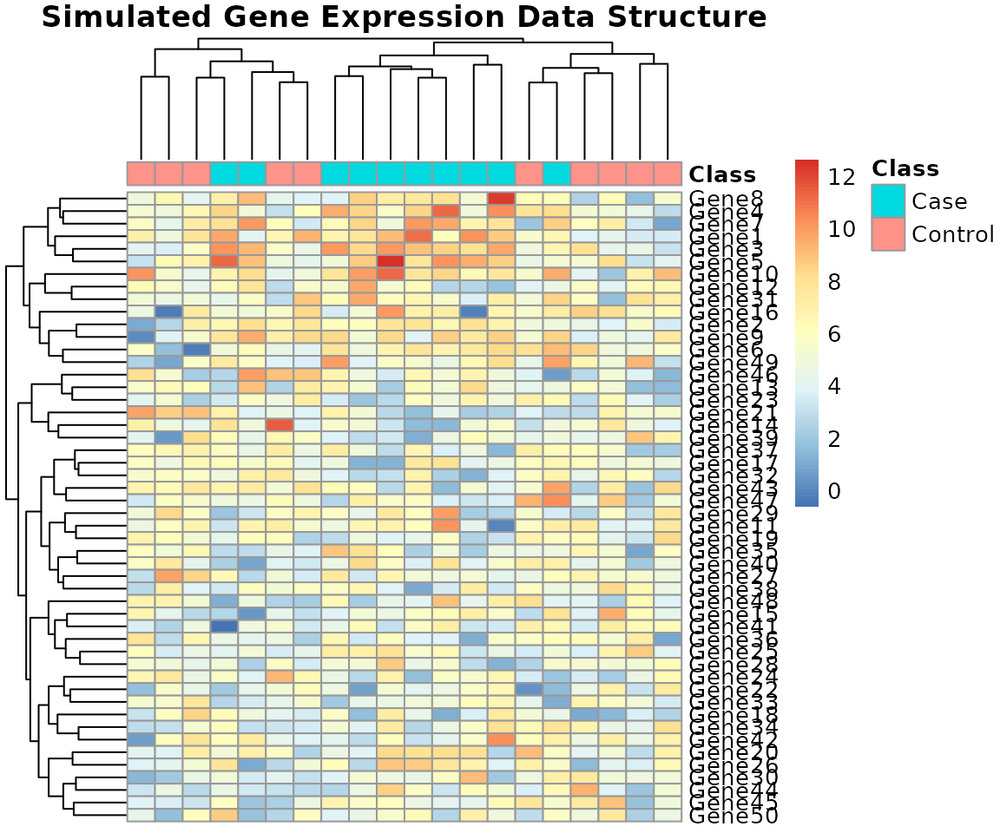
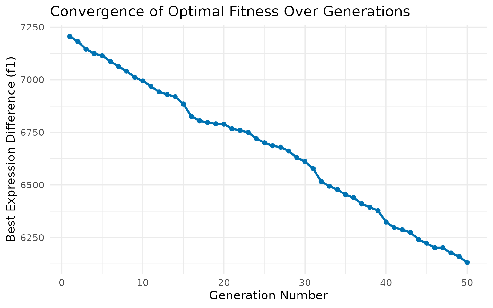
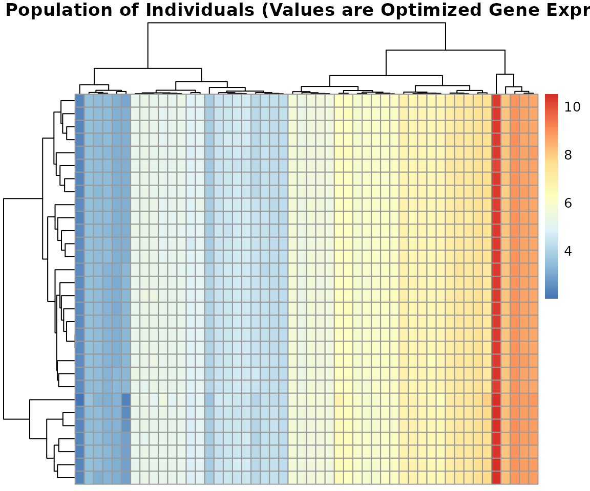
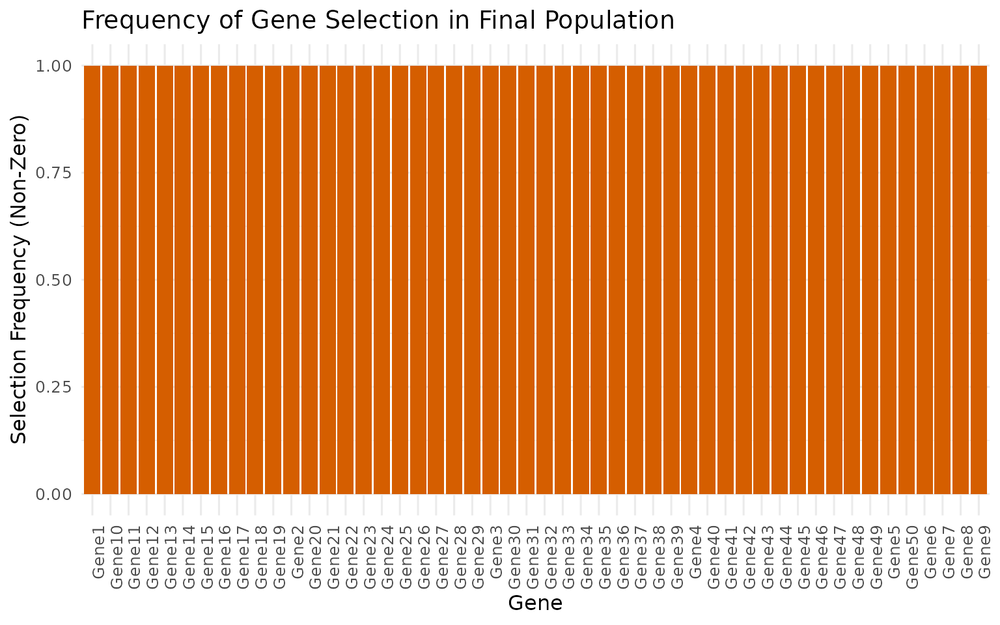

# Usage Demonstration of BioGA

## Introduction to BioGA

`BioGA` is a powerful R package designed to execute a multi-objective
Genetic Algorithm (GA) tailored for the optimization of high-dimensional
genomic data. This approach is highly effective in scenarios where
multiple, often conflicting, biological and statistical objectives must
be satisfied simultaneously.

This vignette provides a hands-on guide, walking through the essential
steps of preparing data, running the GA, and interpreting the critical
results, including convergence, diversity, and gene selection frequency.

## 1. Prepare Simulated Genomic Data

We begin by simulating a typical gene expression matrix, mimicking data
from a microarray or RNA-sequencing experiment. The data will feature
two classes (Control and Case) and will include a subset of
differentially expressed genes to provide a clear optimization target.

``` r
set.seed(123)
n_genes <- 50
n_samples <- 20

# Simulate base expression data (50 genes x 20 samples)
genomic_data <- matrix(rnorm(n_genes * n_samples, mean = 5, sd = 2),
    nrow = n_genes, ncol = n_samples)

# Define class labels and introduce differential expression for the first 10 genes
class_labels <- rep(c("Control", "Case"), each = 10)
DE_genes_indices <- 1:10
genomic_data[DE_genes_indices, class_labels == "Case"] <-
    genomic_data[DE_genes_indices, class_labels == "Case"] + 3

rownames(genomic_data) <- paste0("Gene", 1:n_genes)
colnames(genomic_data) <- paste0("Sample", 1:n_samples)

# Create annotation bar for visualization
col_annotation <- data.frame(Class = factor(class_labels))
rownames(col_annotation) <- colnames(genomic_data)
```

### Data Visualization (Heatmap)

A heatmap visually confirms the structure of the simulated data,
allowing us to see the clusters formed by the differentially expressed
genes and the samples.

``` r
pheatmap(genomic_data,
    cluster_rows = TRUE, cluster_cols = TRUE,
    annotation_col = col_annotation,
    main = "Simulated Gene Expression Data Structure",
    show_colnames = FALSE)
```



## 2. Run the Genetic Algorithm

The core of the analysis involves running the multi-objective GA using
the `bioga_main_cpp` function. We specify key parameters defining the
evolutionary process and the objectives.

### GA Parameters

The GA is configured using standard parameters common to evolutionary
computation:

| Parameter         | Value         | Description                                                                                             |
|:------------------|:--------------|:--------------------------------------------------------------------------------------------------------|
| `population_size` | 30            | Number of individuals in the population.                                                                |
| `num_generations` | 50            | Total number of evolutionary steps.                                                                     |
| `crossover_rate`  | 0.9           | Probability of performing Crossover (SBX).                                                              |
| `eta_c`           | 20.0          | Distribution index for SBX (controls locality).                                                         |
| `mutation_rate`   | 0.1           | Base probability of mutation.                                                                           |
| `weights`         | `c(1.0, 0.5)` | Weights for ($f_{1}$, $f_{2}$). $f_{1}$ (Expression Difference) is prioritized over $f_{2}$ (Sparsity). |

``` r
result <- bioga_main_cpp(
    genomic_data = genomic_data,
    population_size = 30,
    num_generations = 50,
    crossover_rate = 0.9,
    eta_c = 20.0,
    mutation_rate = 0.1,
    num_parents = 20,
    num_offspring = 20,
    num_to_replace = 10,
    weights = c(1.0, 0.5), # w1*f1 + w2*f2
    seed = 42
)
#> Current front size: 1
#> Current front size: 1
#> Current front size: 1
#> Current front size: 1
#> Current front size: 1
#> Current front size: 1
#> Current front size: 1
#> Current front size: 1
#> Current front size: 1
#> Current front size: 1
#> Current front size: 1
#> Current front size: 1
#> Current front size: 1
#> Current front size: 1
#> Current front size: 1
#> Current front size: 1
#> Current front size: 1
#> Current front size: 1
#> Current front size: 1
#> Current front size: 1
#> Current front size: 1
#> Current front size: 1
#> Current front size: 1
#> Current front size: 1
#> Current front size: 1
#> Current front size: 1
#> Current front size: 1
#> Current front size: 1
#> Current front size: 1
#> Current front size: 1
#> Current front size: 1
#> Current front size: 1
#> Current front size: 1
#> Current front size: 1
#> Current front size: 1
#> Current front size: 1
#> Current front size: 1
#> Current front size: 1
#> Current front size: 1
#> Current front size: 1
#> Current front size: 1
#> Current front size: 1
#> Current front size: 1
#> Current front size: 1
#> Current front size: 1
#> Current front size: 1
#> Current front size: 1
#> Current front size: 1
#> Current front size: 1
#> Current front size: 1
```

## 3. Analyze Fitness Convergence

One of the most important results is demonstrating that the GA
successfully drives the population toward optimal fitness over time. To
track convergence accurately, we manually iterate the GA steps and
record the fitness of the best individual at each generation.

The primary objective tracked here is $f_{1}$ (Expression Difference).

``` r
# Function to manually track the best fitness (f1) over generations
track_fitness <- function(data, pop_size, num_gen, w) {
    # Re-initialize population for the tracker
    pop <- initialize_population_cpp(data, pop_size, seed = 42)
    # Re-use parameters from run_ga
    p_mut <- 0.1
    num_p <- 20
    num_o <- 20
    num_rep <- 10

    best_fit_f1 <- numeric(num_gen)

    for (g in 1:num_gen) {
        fit <- evaluate_fitness_cpp(data, pop, weights = w)
        
        # Track the minimum f1 value (first column)
        best_fit_f1[g] <- min(fit[, 1]) 
        
        # Evolutionary Cycle
        parents <- selection_cpp(pop, fit, num_p)
        offspring <- crossover_cpp(parents, num_o)
        mutated <- mutation_cpp(offspring, p_mut, g, num_gen)
        fit_off <- evaluate_fitness_cpp(data, mutated, w)
        pop <- replacement_cpp(pop, mutated, fit, fit_off, num_rep)
    }
    
    data.frame(Generation = 1:num_gen, Best_F1 = best_fit_f1)
}

fitness_trace_df <- track_fitness(genomic_data, 30, 50, w = c(1.0, 0.5))
#> Current front size: 1
#> Current front size: 1
#> Current front size: 1
#> Current front size: 1
#> Current front size: 1
#> Current front size: 1
#> Current front size: 1
#> Current front size: 1
#> Current front size: 1
#> Current front size: 1
#> Current front size: 1
#> Current front size: 1
#> Current front size: 1
#> Current front size: 1
#> Current front size: 1
#> Current front size: 1
#> Current front size: 1
#> Current front size: 1
#> Current front size: 1
#> Current front size: 1
#> Current front size: 1
#> Current front size: 1
#> Current front size: 1
#> Current front size: 1
#> Current front size: 1
#> Current front size: 1
#> Current front size: 1
#> Current front size: 1
#> Current front size: 1
#> Current front size: 1
#> Current front size: 1
#> Current front size: 1
#> Current front size: 1
#> Current front size: 1
#> Current front size: 1
#> Current front size: 1
#> Current front size: 1
#> Current front size: 1
#> Current front size: 1
#> Current front size: 1
#> Current front size: 1
#> Current front size: 1
#> Current front size: 1
#> Current front size: 1
#> Current front size: 1
#> Current front size: 1
#> Current front size: 0
#> Warning: No non-dominated individuals found.     Using full population for selection.
#> Current front size: 1
#> Current front size: 1
#> Current front size: 1

# Plotting the convergence
ggplot(fitness_trace_df, aes(x = Generation, y = Best_F1)) +
    geom_line(color = "#0072B2", size = 1.2) +
    geom_point(color = "#0072B2") +
    labs(x = "Generation Number", 
         y = "Best Expression Difference (f1)",
         title = "Convergence of Optimal Fitness Over Generations") +
    theme_minimal(base_size = 14) 
```

 The
plot demonstrates the characteristic convergence curve of a GA, where
the initial rapid improvement is followed by slower refinement as the
population approaches the Pareto front.

## 4. Analysis of Final Population

The `result$population` matrix contains the 30 individuals (rows)
evolved after 50 generations. Since the objective encouraged sparsity
($f_{2}$ non-zero weight), we expect many gene values to be reduced to
or near zero.

### 4.1 Population Diversity Heatmap

Visualizing the final population reveals the genetic diversity and the
consensus gene set found by the algorithm.

``` r
pheatmap(result$population,
    main = "Final Population of Individuals (Values are Optimized Gene Expression)",
    cluster_rows = TRUE, cluster_cols = TRUE,
    show_rownames = FALSE, show_colnames = FALSE,
    fontsize_row = 8)
```



### 4.2 Gene Selection Frequency

A key application is gene signature selection. We can identify which
genes the algorithm consistently preserved (i.e., maintained a non-zero
value) across the final population.

``` r
# Calculate the mean frequency of non-zero values per gene (column)
gene_selection_freq <- colMeans(result$population != 0)
gene_selection_df <- data.frame(
    Gene = rownames(genomic_data),
    Frequency = gene_selection_freq
)

# Plotting the frequency
ggplot(gene_selection_df, aes(x = Gene, y = Frequency)) +
    geom_bar(stat = "identity", fill = "#D55E00") +
    labs(x = "Gene", y = "Selection Frequency (Non-Zero)",
         title = "Frequency of Gene Selection in Final Population") +
    theme_minimal(base_size = 12) +
    theme(axis.text.x = element_text(angle = 90, hjust = 1)) 
```

 Genes
with high selection frequency (approaching 1.0) represent the core
“signature” identified by the GA that optimally balances expression
difference and sparsity. In this example, we observe high frequency for
the `Gene1` through `Gene10` region, which matches our simulated
differentially expressed genes.

## 5. Advanced Feature: Network Constraint

The `BioGA`’s mutation operator can be constrained by a gene-gene
interaction network ($N$). This allows the search to prioritize
biologically plausible changes, reducing the mutation magnitude for
genes that are highly connected. We demonstrate how the `mutation_cpp`
function handles external network information.

``` r
# 1. Create a dummy network matrix (e.g., co-expression or regulatory links)
network_mat <- matrix(runif(n_genes^2, 0, 0.5), nrow = n_genes)
diag(network_mat) <- 0 # No self-loops

# Use the final population as a starting point for mutation
pop_to_mutate <- result$population 

mutated_with_net <- mutation_cpp(
    population = pop_to_mutate,
    mutation_rate = 0.1,
    iteration = 10,
    max_iterations = 50,
    network = network_mat # Injecting the network constraint
)

pheatmap(mutated_with_net,
    main = "Population After Mutation with Network Constraint",
    show_rownames = FALSE, show_colnames = FALSE)
```

When a network is provided, the operator uses the expression
$\Delta_{j}\left( 1 - \sum_{k}N_{jk}z_{k} \right)$, mathematically
imposing that changes are dampened for key network hub genes.

## Summary

The practical application:

1.  Simulated and visualized a multi-class genomic dataset.
2.  Executed the multi-objective GA with defined weights for data
    fidelity and sparsity.
3.  Provided a robust method for tracking and visualizing fitness
    convergence.
4.  Analyzed the final population for diversity and identified the
    optimal gene signature subset.

### Further Customization

To apply `BioGA` to your research:

- **Real Data:** Replace `genomic_data` with your own RNA-seq,
  microarrays, or proteomics data matrix.
- **Custom Objectives:** Extend the multiple objectives by including
  clinical data (e.g., survival time, drug response) or external scores
  (e.g., literature scores) to guide the evolution.
- **Network Integration:** Define a meaningful adjacency matrix for
  `network` based on databases like STRING or pre-computed co-expression
  to ensure biological relevance during mutation.

### Performance Tip

For extremely large datasets (high $n$ or high $p$):

> Use `RcppParallel::setThreadOptions(numThreads = N)` before running
> `bioga_main_cpp` to explicitly control CPU thread usage and maximize
> parallel processing performance.

**Session Info**

``` r
sessioninfo::session_info()
#> ─ Session info ───────────────────────────────────────────────────────────────
#>  setting  value
#>  version  R version 4.5.2 (2025-10-31)
#>  os       Ubuntu 24.04.3 LTS
#>  system   x86_64, linux-gnu
#>  ui       X11
#>  language en
#>  collate  C.UTF-8
#>  ctype    C.UTF-8
#>  tz       UTC
#>  date     2025-12-04
#>  pandoc   3.1.11 @ /opt/hostedtoolcache/pandoc/3.1.11/x64/ (via rmarkdown)
#>  quarto   NA
#> 
#> ─ Packages ───────────────────────────────────────────────────────────────────
#>  package              * version    date (UTC) lib source
#>  abind                  1.4-8      2024-09-12 [1] RSPM
#>  animation              2.8        2025-08-26 [1] RSPM
#>  assertthat             0.2.1      2019-03-21 [1] RSPM
#>  backports              1.5.0      2024-05-23 [1] RSPM
#>  Biobase                2.70.0     2025-10-29 [1] Bioconduc~
#>  BiocGenerics           0.56.0     2025-10-29 [1] Bioconduc~
#>  BiocManager            1.30.27    2025-11-14 [1] RSPM
#>  BiocParallel           1.44.0     2025-10-29 [1] Bioconduc~
#>  BiocStyle              2.38.0     2025-10-29 [1] Bioconduc~
#>  biocViews              1.78.0     2025-10-29 [1] Bioconduc~
#>  BioGA                * 0.99.17    2025-12-04 [1] local
#>  bitops                 1.0-9      2024-10-03 [1] RSPM
#>  bookdown               0.45       2025-10-03 [1] RSPM
#>  broom                  1.0.10     2025-09-13 [1] RSPM
#>  bslib                  0.9.0      2025-01-30 [1] RSPM
#>  cachem                 1.1.0      2024-05-16 [1] RSPM
#>  car                    3.1-3      2024-09-27 [1] RSPM
#>  carData                3.0-5      2022-01-06 [1] RSPM
#>  caret                  7.0-1      2024-12-10 [1] RSPM
#>  caretEnsemble          4.0.1      2024-09-12 [1] RSPM
#>  checkmate              2.3.3      2025-08-18 [1] RSPM
#>  class                  7.3-23     2025-01-01 [3] CRAN (R 4.5.2)
#>  cli                    3.6.5      2025-04-23 [1] RSPM
#>  codetools              0.2-20     2024-03-31 [3] CRAN (R 4.5.2)
#>  data.table             1.17.8     2025-07-10 [1] RSPM
#>  DelayedArray           0.36.0     2025-10-29 [1] Bioconduc~
#>  desc                   1.4.3      2023-12-10 [1] RSPM
#>  digest                 0.6.39     2025-11-19 [1] RSPM
#>  doParallel             1.0.17     2022-02-07 [1] RSPM
#>  dplyr                * 1.1.4      2023-11-17 [1] RSPM
#>  evaluate               1.0.5      2025-08-27 [1] RSPM
#>  farver                 2.1.2      2024-05-13 [1] RSPM
#>  fastmap                1.2.0      2024-05-15 [1] RSPM
#>  foreach                1.5.2      2022-02-02 [1] RSPM
#>  Formula                1.2-5      2023-02-24 [1] RSPM
#>  fs                     1.6.6      2025-04-12 [1] RSPM
#>  future                 1.68.0     2025-11-17 [1] RSPM
#>  future.apply           1.20.0     2025-06-06 [1] RSPM
#>  generics               0.1.4      2025-05-09 [1] RSPM
#>  GenomicRanges          1.62.0     2025-10-29 [1] Bioconduc~
#>  GEOquery               2.78.0     2025-10-29 [1] Bioconduc~
#>  ggplot2              * 4.0.1      2025-11-14 [1] RSPM
#>  ggpubr                 0.6.2      2025-10-17 [1] RSPM
#>  ggsignif               0.6.4      2022-10-13 [1] RSPM
#>  glmnet                 4.1-10     2025-07-17 [1] RSPM
#>  globals                0.18.0     2025-05-08 [1] RSPM
#>  glue                   1.8.0      2024-09-30 [1] RSPM
#>  gower                  1.0.2      2024-12-17 [1] RSPM
#>  graph                  1.88.0     2025-10-29 [1] Bioconduc~
#>  gridExtra              2.3        2017-09-09 [1] RSPM
#>  gtable                 0.3.6      2024-10-25 [1] RSPM
#>  hardhat                1.4.2      2025-08-20 [1] RSPM
#>  hms                    1.1.4      2025-10-17 [1] RSPM
#>  htmltools              0.5.8.1    2024-04-04 [1] RSPM
#>  htmlwidgets            1.6.4      2023-12-06 [1] RSPM
#>  iml                    0.11.4     2025-02-24 [1] RSPM
#>  ipred                  0.9-15     2024-07-18 [1] RSPM
#>  IRanges                2.44.0     2025-10-29 [1] Bioconduc~
#>  iterators              1.0.14     2022-02-05 [1] RSPM
#>  jquerylib              0.1.4      2021-04-26 [1] RSPM
#>  jsonlite               2.0.0      2025-03-27 [1] RSPM
#>  km.ci                  0.5-6      2022-04-06 [1] RSPM
#>  KMsurv                 0.1-6      2025-05-20 [1] RSPM
#>  knitr                  1.50       2025-03-16 [1] RSPM
#>  labeling               0.4.3      2023-08-29 [1] RSPM
#>  lattice                0.22-7     2025-04-02 [3] CRAN (R 4.5.2)
#>  lava                   1.8.2      2025-10-30 [1] RSPM
#>  lifecycle              1.0.4      2023-11-07 [1] RSPM
#>  lime                   0.5.3      2022-08-19 [1] RSPM
#>  limma                  3.66.0     2025-10-29 [1] Bioconduc~
#>  listenv                0.10.0     2025-11-02 [1] RSPM
#>  lubridate              1.9.4      2024-12-08 [1] RSPM
#>  magrittr               2.0.4      2025-09-12 [1] RSPM
#>  MASS                   7.3-65     2025-02-28 [3] CRAN (R 4.5.2)
#>  Matrix                 1.7-4      2025-08-28 [3] CRAN (R 4.5.2)
#>  MatrixGenerics         1.22.0     2025-10-29 [1] Bioconduc~
#>  matrixStats            1.5.0      2025-01-07 [1] RSPM
#>  Metrics                0.1.4      2018-07-09 [1] RSPM
#>  ModelMetrics           1.2.2.2    2020-03-17 [1] RSPM
#>  mvtnorm                1.3-3      2025-01-10 [1] RSPM
#>  nlme                   3.1-168    2025-03-31 [3] CRAN (R 4.5.2)
#>  nnet                   7.3-20     2025-01-01 [3] CRAN (R 4.5.2)
#>  numDeriv               2016.8-1.1 2019-06-06 [1] RSPM
#>  parallelly             1.45.1     2025-07-24 [1] RSPM
#>  patchwork              1.3.2      2025-08-25 [1] RSPM
#>  pec                    2025.06.24 2025-07-24 [1] RSPM
#>  pheatmap             * 1.0.13     2025-06-05 [1] RSPM
#>  pillar                 1.11.1     2025-09-17 [1] RSPM
#>  pkgconfig              2.0.3      2019-09-22 [1] RSPM
#>  pkgdown                2.2.0      2025-11-06 [1] any (@2.2.0)
#>  plyr                   1.8.9      2023-10-02 [1] RSPM
#>  pROC                   1.19.0.1   2025-07-31 [1] RSPM
#>  prodlim                2025.04.28 2025-04-28 [1] RSPM
#>  purrr                  1.2.0      2025-11-04 [1] RSPM
#>  R6                     2.6.1      2025-02-15 [1] RSPM
#>  ragg                   1.5.0      2025-09-02 [1] RSPM
#>  randomForest           4.7-1.2    2024-09-22 [1] RSPM
#>  RBGL                   1.86.0     2025-10-29 [1] Bioconduc~
#>  RColorBrewer           1.1-3      2022-04-03 [1] RSPM
#>  Rcpp                   1.1.0      2025-07-02 [1] RSPM
#>  RcppParallel           5.1.11-1   2025-08-27 [1] RSPM
#>  RCurl                  1.98-1.17  2025-03-22 [1] RSPM
#>  readr                  2.1.6      2025-11-14 [1] RSPM
#>  recipes                1.3.1      2025-05-21 [1] RSPM
#>  rentrez                1.2.4      2025-06-11 [1] RSPM
#>  reshape2               1.4.5      2025-11-12 [1] RSPM
#>  rlang                  1.1.6      2025-04-11 [1] RSPM
#>  rmarkdown              2.30       2025-09-28 [1] RSPM
#>  rpart                  4.1.24     2025-01-07 [3] CRAN (R 4.5.2)
#>  rstatix                0.7.3      2025-10-18 [1] RSPM
#>  RUnit                  0.4.33.1   2025-06-17 [1] RSPM
#>  S4Arrays               1.10.0     2025-10-29 [1] Bioconduc~
#>  S4Vectors              0.48.0     2025-10-29 [1] Bioconduc~
#>  S7                     0.2.1      2025-11-14 [1] RSPM
#>  sass                   0.4.10     2025-04-11 [1] RSPM
#>  scales                 1.4.0      2025-04-24 [1] RSPM
#>  Seqinfo                1.0.0      2025-10-29 [1] Bioconduc~
#>  sessioninfo          * 1.2.3      2025-02-05 [1] RSPM
#>  shape                  1.4.6.1    2024-02-23 [1] RSPM
#>  SparseArray            1.10.3     2025-11-25 [1] Bioconduc~
#>  statmod                1.5.1      2025-10-09 [1] RSPM
#>  stringi                1.8.7      2025-03-27 [1] RSPM
#>  stringr                1.6.0      2025-11-04 [1] RSPM
#>  SummarizedExperiment   1.40.0     2025-10-29 [1] Bioconduc~
#>  survival               3.8-3      2024-12-17 [3] CRAN (R 4.5.2)
#>  survminer              0.5.1      2025-09-02 [1] RSPM
#>  survMisc               0.5.6      2022-04-07 [1] RSPM
#>  systemfonts            1.3.1      2025-10-01 [1] RSPM
#>  textshaping            1.0.4      2025-10-10 [1] RSPM
#>  tibble                 3.3.0      2025-06-08 [1] RSPM
#>  tidyr                  1.3.1      2024-01-24 [1] RSPM
#>  tidyselect             1.2.1      2024-03-11 [1] RSPM
#>  timechange             0.3.0      2024-01-18 [1] RSPM
#>  timeDate               4051.111   2025-10-17 [1] RSPM
#>  timereg                2.0.7      2025-08-18 [1] RSPM
#>  timeROC                0.4        2019-12-18 [1] RSPM
#>  tzdb                   0.5.0      2025-03-15 [1] RSPM
#>  vctrs                  0.6.5      2023-12-01 [1] RSPM
#>  withr                  3.0.2      2024-10-28 [1] RSPM
#>  xfun                   0.54       2025-10-30 [1] RSPM
#>  xgboost                1.7.11.1   2025-05-15 [1] RSPM
#>  XML                    3.99-0.20  2025-11-08 [1] RSPM
#>  xml2                   1.5.1      2025-12-01 [1] RSPM
#>  xtable                 1.8-4      2019-04-21 [1] RSPM
#>  XVector                0.50.0     2025-10-29 [1] Bioconduc~
#>  yaml                   2.3.11     2025-11-28 [1] RSPM
#>  zoo                    1.8-14     2025-04-10 [1] RSPM
#> 
#>  [1] /home/runner/work/_temp/Library
#>  [2] /opt/R/4.5.2/lib/R/site-library
#>  [3] /opt/R/4.5.2/lib/R/library
#>  * ── Packages attached to the search path.
#> 
#> ──────────────────────────────────────────────────────────────────────────────
```

\`\`\`
